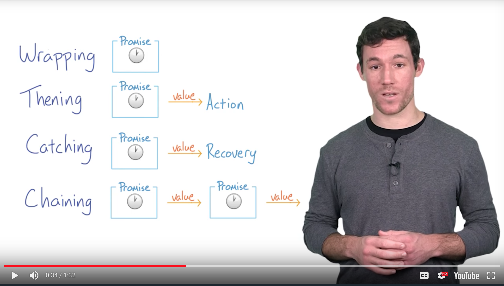

JavaScript Promise

​	"The Promise object is used for deferred and asynchronous computations"

.then 



There are four stages.

thenning and catching will handle error and action

chaining will introduce how to combine mutiple promises.

[Primers Promise definitions](https://developers.google.com/web/fundamentals/primers/promises)

There are three results: fulfilled (Resolved): It worked

Rejected: It didn't work :(

Pending: Still waiting.

Settled: something happened!

A promise can only settle once. (on main thread and potentially stucking)

resolve leads to return; reject leads to reject. 

document.readyState has three state 'loading' 'interactive' 'complete'

'readystatechange' event will fire as the state change

# Types of request!

XMLHttpRequest.open() thrid argument is true for processing Asynchronously, otherwise synchronously. 

By analyzing and manipulating the **responseXML** property. 

four ways to analyzing XML document:

 1.XPath to address(or point to ) parts of it.

2. Manually Parsing and serializing XML to strings or objects.

3. Using **XMLSerializer** to serialize DOM trees to strings or to files.

4. RegExp can be used if you always know the content of the XML document beforehand. 

   XMLHttpRequest can be used for both textual data and binary content.

   ​	How to force changing to binary content by using overrideMineType() method： 	

   ```javascript
   var oReq = new XMLHttpRequest();
   oReq.open("GET", url);
   // retrieve data unprocessed as a binary string
   oReq.overrideMimeType("text/plain; charset=x-user-defined");
   /* ... */

   ```

   By using responseType attribute to support additional content type.

```javascript
var oReq = new XMLHttpRequest();
oReq.onload = function(e){
  var arraybuffer = oReq.response;
}
oReq.open("GET", url);
oReq.responseType = "arraybuffer";
oReq.send();
```

**ProgressEvent** interface used in monitoring XMLHttpRequest (DOM progress) 

```javascript
var oReq = new XMLHttpRequest();

oReq.addEventListener("progress", updateProgress);
oReq.addEventListener("load", transferComplete);
oReq.addEventListener("error", transferFailed);
oReq.addEventListener("abort", transferCanceled);

oReq.open();

// ...

// progress on transfers from the server to the client (downloads)
function updateProgress (oEvent) {
  // lengthComputable could be zero or unknown if it is false.
  if (oEvent.lengthComputable) {
    var percentComplete = oEvent.loaded / oEvent.total;
    // ...
  } else {
    // Unable to compute progress information since the total size is unknown
  }
}

function transferComplete(evt) {
  console.log("The transfer is complete.");
}

function transferFailed(evt) {
  console.log("An error occurred while transferring the file.");
}

function transferCanceled(evt) {
  console.log("The transfer has been canceled by the user.");
}
```

download transfer is object itself, but upload events are fired on the **XMLHttpRequest.upload** object.

Loadend can detect three load-conditions(abort, load, or error).

Submit forms:	AJAX or FormData API

FormData API can not use [stringifiled](https://developer.mozilla.org/en-US/docs/Web/JavaScript/Reference/Global_Objects/JSON/stringify) data

FileReader API is only required when there is one or more files have been uploaded.

forms can sent in four ways:

	1. POST method, enctype, 'application/x-www-form-urlencoded';
	2. 'text/plain'
	3. 'multipart/form-data'
	4. GET method


